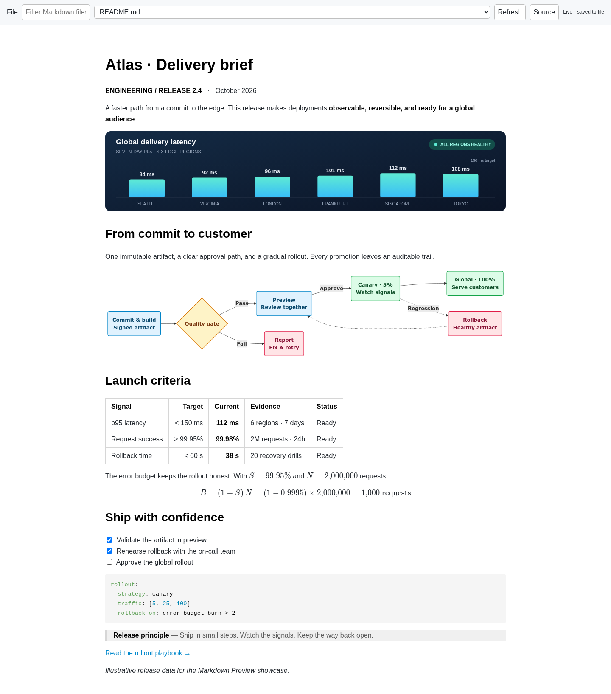
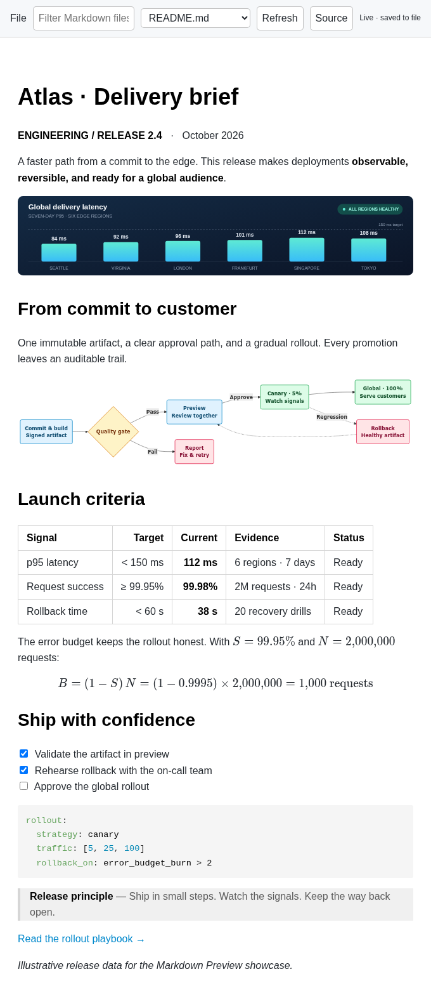
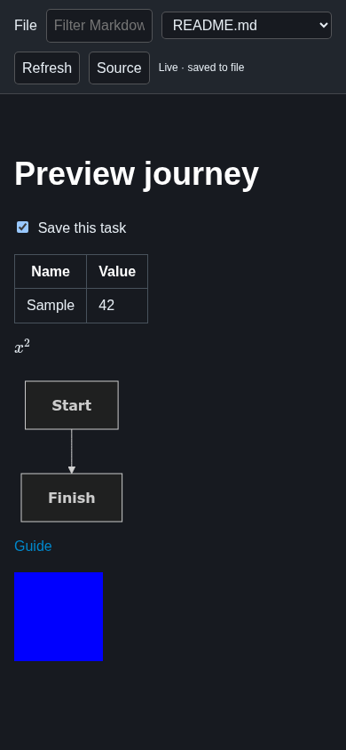
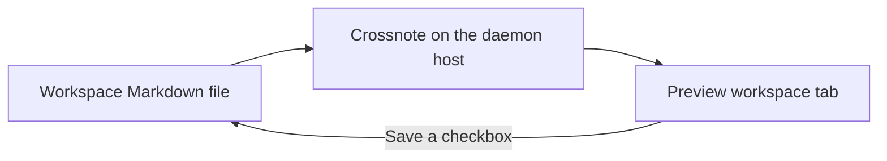
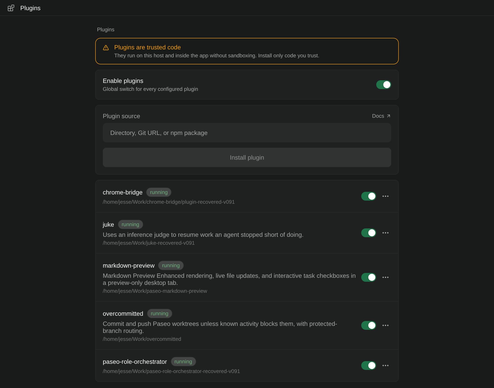

<div align="center">


# Paseo Markdown Preview


[Features](#features) · [Getting started](#getting-started) · [Compatibility](#compatibility) · [Reference](docs/REFERENCE.md)

</div>

Read Markdown as a document, with diagrams, math, images, and task checkboxes that save back to the file. This plugin brings the Crossnote renderer behind Markdown Preview Enhanced into a Paseo workspace tab.

## Features

| Feature | What you get |
| --- | --- |
| Preview-only tab | One document view, with a file selector and source toggle |
| Interactive tasks | Checkboxes save to the original file; stale edits are rejected |
| Rich Markdown | Tables, highlighted code, KaTeX math, and Mermaid diagrams |
| Local navigation | Follow Markdown links and enlarge workspace images |
| Live updates | Changes to the selected source file appear automatically |
| Light and dark | Rendering follows the Paseo panel theme where available |



*A real browser capture of the [showcase document](docs/showcase/README.md), with illustrative release data.*

<details>
<summary>Compact layout and dark theme</summary>





</details>

## How it fits



## Getting started

Requires Node.js, npm, Paseo 0.9.1, and plugins enabled on the target daemon. Clone the repository and install it as a directory:

```bash
git clone https://github.com/papag00se/paseo-markdown-preview.git
cd paseo-markdown-preview
npm ci --legacy-peer-deps
npm run typecheck
paseo plugin install "$PWD"
```

In a workspace, open **Command Center → Open Markdown Preview**, then choose a file. There is no need to open the source editor.



## Compatibility

Desktop/web clients must run on the daemon machine: the renderer uses a loopback-only service. Native mobile and remote clients are not supported by this renderer. The [Crossnote file-preview fork](https://github.com/papag00se/paseo/tree/feature/crossnote-file-preview) opens desktop Markdown files in their existing file tabs and adds right-click → **Preview**. Stock Paseo still uses its built-in file preview; the plugin's workspace panel works independently.

This version supports **directory installation**. Crossnote's assets and native dependencies require a generated local dependency path; run `npm run prepare` after moving the checkout. Direct Git/npm acquisition is not supported yet.

## Development

```bash
npm run typecheck
npm test
npm run preview -- /absolute/path/to/workspace
```

The tests cover the browser journey, actual Crossnote rendering, task persistence, UTF-8/BOM/CRLF preservation, stale revisions, workspace confinement, and selected-file embedding/session cleanup, panel close/reopen, late RPC cleanup, session renewal after sleep, and Retry recovery. Browser tests use `/usr/bin/chromium` or `CHROMIUM_PATH`.

[Rendering limits and implementation notes →](docs/REFERENCE.md)
