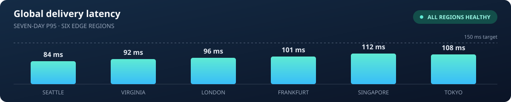
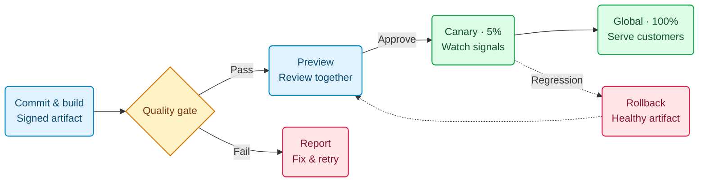

# Atlas · Delivery brief

**ENGINEERING / RELEASE 2.4** &nbsp; · &nbsp; October 2026

A faster path from a commit to the edge. This release makes deployments **observable, reversible, and ready for a global audience**.



## From commit to customer

One immutable artifact, a clear approval path, and a gradual rollout. Every promotion leaves an auditable trail.



## Launch criteria

| Signal | Target | Current | Evidence | Status |
| :--- | ---: | ---: | :--- | :--- |
| p95 latency | < 150 ms | **112 ms** | 6 regions · 7 days | Ready |
| Request success | ≥ 99.95% | **99.98%** | 2M requests · 24h | Ready |
| Rollback time | < 60 s | **38 s** | 20 recovery drills | Ready |

The error budget keeps the rollout honest. With $S = 99.95\%$ and $N = 2{,}000{,}000$ requests:

$$
B = (1 - S)\,N = (1 - 0.9995) \times 2{,}000{,}000 = 1{,}000\ \text{requests}
$$

## Ship with confidence

- [x] Validate the artifact in preview
- [x] Rehearse rollback with the on-call team
- [ ] Approve the global rollout

```yaml
rollout:
  strategy: canary
  traffic: [5, 25, 100]
  rollback_on: error_budget_burn > 2
```

> **Release principle** — Ship in small steps. Watch the signals. Keep the way back open.

[Read the rollout playbook →](playbook.md)

*Illustrative release data for the Markdown Preview showcase.*
